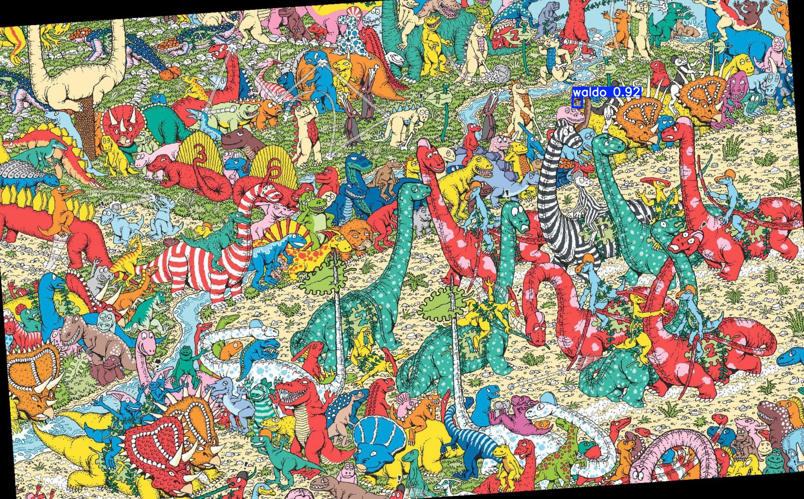

# Where's Waldo? AI

## Project Overview

The "Where's Waldo? AI" project uses machine learning techniques to detect Waldo in images. This project leverages the YOLOv5 object detection model to identify Waldo in various images, making it easier to locate him in the classic "Where's Waldo?" puzzles. The motivation behind this project was to put AI into something unorthodox at first and see the possible use cases of it.

## Features

- **Object Detection**: Uses YOLOv5 to detect Waldo in images.
- **Image Annotation**: Visualizes detection results with bounding boxes around Waldo.

## Requirements

- Python 3.7 or later
- `torch` 1.7.0 or later
- `torchvision` 0.8.0 or later

## Installation

1. Download the Dataset from here: https://universe.roboflow.com/tan-rmi/whereiswaldo-ssmol/dataset/1
2. Download the weights from here: https://drive.google.com/drive/folders/1frst8S5lJDwAnfBQNfSjsnZaJSoTjUTX?usp=sharing
3. Load the IPYNB file and follow the steps
4. Test the model yourself by uploading an image you want ( Steps mentioned in the IPYNB file)

## Results
A few results from training the model during development phase :

